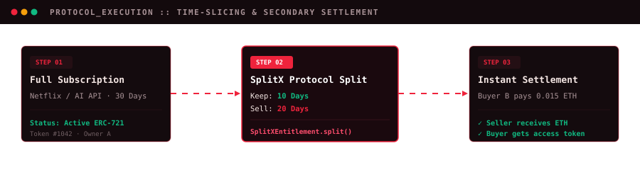

<p align="center">
  
</p>

<p align="center">
  <a href="https://sepolia.arbiscan.io/address/0x7d28c157ACB43C8D7423De156BE3Bef9e793f50A"></a>
  <a href="#-deployed-smart-contracts"></a>
  <a href="#-tech-stack"></a>
  <a href="#-license"></a>
</p>

```
  ███████╗██████╗ ██╗     ██╗████████╗██╗  ██╗
  ██╔════╝██╔══██╗██║     ██║╚══██╔══╝╚██╗██╔╝
  ███████╗██████╔╝██║     ██║   ██║    ╚███╔╝ 
  ╚════██║██╔═══╝ ██║     ██║   ██║    ██╔██╗ 
  ███████║██║     ███████╗██║   ██║   ██╔╝ ██╗
  ╚══════╝╚═╝     ╚══════╝╚═╝   ╚═╝   ╚═╝  ╚═╝
   T I M E - T O K E N I Z E D   E X C H A N G E
```

<h3 align="center">
  <b>&ldquo;KEEP THE DAYS YOU NEED. SELL THE REST.&rdquo;</b>
</h3>

<p align="center">
  SplitX is a non-custodial secondary marketplace protocol that allows users to <b>tokenize, split, and resell unused subscription time</b> (Netflix, Spotify, ChatGPT Plus, Midjourney, Cursor, Cloud Compute) into granular ERC-721 time entitlements with instant ETH settlement on <b>Arbitrum Sepolia</b>.
</p>

---

## ⚡ The Problem vs. The SplitX Protocol

```
Traditional Subscriptions:
[ Day 01 ────────────────────── Day 10 ── (Vacation / Unused) ── Day 30 ]
  ↳ Paid 100% · Used 33% · 67% Sunk Capital Wasted 💸

The SplitX Protocol:
[ Day 01 ──── Day 10 ]  +  [ Day 11 ────────────────────────────── Day 30 ]
   ↳ Retained by User         ↳ Minted & Listed on SplitX Marketplace
                                 ↳ Instantly Sold for ETH to Another Buyer 💰
```

---

## 🛰️ Interactive Protocol Execution Flow

<p align="center">
  
</p>

1. **Minting & Verification:** Subscription entitlements are minted as ERC-721 NFTs with embedded duration, unit parameters, and expiry metadata verified via the provider adapter.
2. **Non-Destructive Splitting:** The user chooses how many days to keep. `SplitXEntitlement.split()` retains the chosen time slice and splits off the remaining days into a new sellable token.
3. **Escrow & Instant Settlement:** The seller lists the remaining time token on `SplitXMarketplace.sol`. The contract holds the NFT in non-custodial escrow until an on-chain buyer purchases it with ETH.
4. **Instant Transfer & Provisioning:** The seller receives ETH instantly; the buyer receives the NFT credential and can immediately access the service.

---

## 💎 Core Capabilities

- ⏱️ **Granular Time-Slicing:** Subdivide any 30, 60, or 90-day subscription into customized day-by-day fractional entitlements.
- 🛡️ **Non-Custodial Escrow Protocol:** Zero counterparty risk. The marketplace contract atomically matches buyers and sellers with no intermediary escrow agents.
- ⚡ **Arbitrum Sepolia Layer-2 Speed:** Low gas fees (< $0.01 per transaction) with sub-second finality.
- 🎮 **Tactical Cyberpunk Aesthetic:** Built with a high-contrast dark palette, dynamic chromatic aberration glitch typography, ambient crimson blooms (`#ef233c`), and fluid micro-animations.
- 🔄 **Dual Operational Modes:**
  - **Live Web3 Mode:** Connect MetaMask or any injected Web3 wallet to interact directly with deployed Arbitrum Sepolia smart contracts.
  - **Demo Ledger Mode:** Full end-to-end interactive demo with pre-funded wallets (Seller & Buyer) so judges and visitors can run the entire split-and-buy lifecycle with zero setup.

---

## 📑 Deployed Smart Contracts (Arbitrum Sepolia)

All contracts are deployed and verified on **Arbitrum Sepolia** (Chain ID: `421614`):

| Contract | Address | Explorer Link | Purpose |
| :--- | :--- | :--- | :--- |
| **`SplitXMarketplace`** | `0x7d28c157ACB43C8D7423De156BE3Bef9e793f50A` | [View on Arbiscan ↗](https://sepolia.arbiscan.io/address/0x7d28c157ACB43C8D7423De156BE3Bef9e793f50A) | Non-custodial escrow & listing marketplace |
| **`SplitXEntitlement`** | `0x04580E3B68a16C990aDE4723634c8456de02533d` | [View on Arbiscan ↗](https://sepolia.arbiscan.io/address/0x04580E3B68a16C990aDE4723634c8456de02533d) | ERC-721 tokenized subscription time slices |
| **`MockProviderAdapter`** | `0x563aAF7D33DE340142e53B89594db2fB71252A8d` | [View on Arbiscan ↗](https://sepolia.arbiscan.io/address/0x563aAF7D33DE340142e53B89594db2fB71252A8d) | Service simulation & access credential minting |

---

## 🏗️ Architecture Overview

```mermaid
graph LR
    subgraph Frontend["Frontend Client (TanStack Start + Vite)"]
        UI["Tactical Web3 UI"]
        Ledger["Dual-Mode State Machine (Live Web3 / Demo Ledger)"]
        Wallet["Injected Web3 Provider (viem / wagmi)"]
    end

    subgraph Contracts["Arbitrum Sepolia (Chain ID: 421614)"]
        Marketplace["SplitXMarketplace.sol<br/>(Escrow & Settlement)"]
        Entitlement["SplitXEntitlement.sol<br/>(ERC-721 Time Slices)"]
        Adapter["MockProviderAdapter.sol<br/>(Service Oracle)"]
    end

    subgraph Services["Time-Tokenized Catalogs"]
        Netflix["Streaming (Netflix / Spotify)"]
        AI["AI Compute (ChatGPT / Claude / Midjourney)"]
        Dev["Developer Cloud (Cursor / AWS Compute)"]
    end

    UI --> Ledger
    Ledger --> Wallet
    Wallet -->|List / Buy (ETH)| Marketplace
    Wallet -->|Split / Transfer| Entitlement
    Marketplace -->|Lock / Release| Entitlement
    Adapter -->|Authorize| Services
```

---

## 🛠️ Tech Stack

- **Smart Contracts:** Solidity `^0.8.20`, Hardhat, OpenZeppelin Contracts (ERC-721, ReentrancyGuard, Ownable)
- **Frontend Framework:** React 19, TanStack Start, TanStack Router, Vite
- **Styling & Motion:** Tailwind CSS v4, Radix UI primitives, Lucide Icons, Custom CSS `@keyframes` Glitch Engine
- **Web3 Integration:** `viem`, `ox`, Injected EIP-1193 Provider
- **Deployment:** Vercel (Frontend with Nitro preset) + Arbitrum Sepolia Rollup

---

## 🚀 Quickstart & Local Development

### 1. Clone & Install
```bash
git clone https://github.com/sufiyan1406/SplitX.git
cd SplitX
```

### 2. Run Smart Contracts & Backend (Root Directory)
```bash
# Install root dependencies
npm install

# Compile Solidity contracts
npx hardhat compile

# Run Hardhat test suite
npx hardhat test

# Start the mock provider adapter server
npm run server
```

### 3. Run Frontend Web App
```bash
cd frontend
npm install
npm run dev
```

Visit [`http://localhost:3000`](http://localhost:3000) to view the application.

---

## 🌐 Vercel Deployment Guide

To deploy SplitX to Vercel without 404 errors:

1. **Import Repository** on Vercel.
2. In **Project Settings $\rightarrow$ General**:
   - **Root Directory:** Set to `frontend`
   - **Framework Preset:** `Vite`
   - **Build Command:** `npm run build`
   - **Output Directory:** Leave blank (or `.vercel/output`)
3. In **Project Settings $\rightarrow$ Environment Variables**:
   - `VITE_AUTH_ENABLED` = `false` *(Activates hackathon demo mode; prevents missing DB errors)*
   - `VITE_API_URL` = *(Optional: your hosted server backend URL)*
4. Click **Deploy**.

---

## 📄 License

This project is licensed under the **MIT License** — see the [LICENSE](LICENSE) file for details.

<p align="center">
  <sub>Engineered with precision for the future of decentralized time-tokenized commerce.</sub>
</p>
